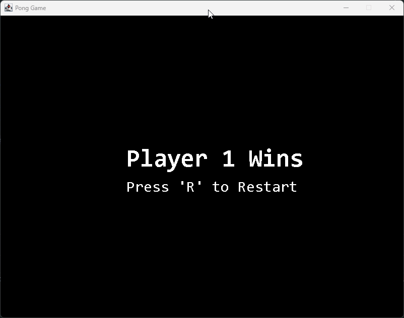

# **Classic Pong Game in Java**




### **Description**

This is my personal implementation of the classic Pong game using Java. This project was created to solidify my Java skills, focusing on object-oriented programming, GUI development, and collision handling. It also serves as a practical preparation for the Oracle Certified Foundations Associate, Java (1Z0-811) exam.

The game features two-player mode, adjustable paddle speeds, and a scoring system with a win condition. Players can restart the game once a winner has been declared. The project utilizes **Java Swing** to create the graphical user interface.

---

### **Features**

- **Two-Player Mode**: Play with a friend locally using separate keys to control each paddle.
- **Paddle Controls**: Player 1 uses W/S keys, and Player 2 uses the Up/Down arrow keys.
- **Ball Movement**: The ball moves smoothly across the screen, bouncing off the walls and paddles.
- **Scoring System**: The game keeps track of scores, and the first player to reach 10 points wins.
- **Win Condition and Reset**: When a player reaches 10 points, a win message is displayed, and the game can be reset with the "R" key.
- **Adjustable Paddle Speed**: Players' paddle speeds can be adjusted for faster or slower gameplay.

---

### **Getting Started**

#### **Prerequisites**

- **Java JDK 8 or later**: Make sure you have the JDK installed. You can download it [here](https://www.oracle.com/java/technologies/javase-downloads.html).
- **IDE**: Use an IDE such as **IntelliJ IDEA**, **Eclipse**, or **NetBeans** for easier development and debugging.

#### **Running the Project**

1. **Clone the Repository**:

   ```
   git clone https://github.com/yourusername/Java-Pong-Game.git
   ```

2. **Navigate into the Project Directory**:

   ```
   cd Java-Pong-Game
   ```

3. **Compile and Run**:
   Open the project in your IDE and run the `GameFrame.java` class.

---

### **Controls**

- **Player 1**:
  - Move Up: **W**
  - Move Down: **S**
- **Player 2**:
  - Move Up: **Up Arrow**
  - Move Down: **Down Arrow**
- **Reset Game**: Press **R** after a win to reset.

---

### **Project Structure**

```plaintext
src/
├── com/
│   └── ponggame/
│       ├── Ball.java         # Handles ball movement and collisions
│       ├── GameFrame.java    # Main game window (JFrame)
│       ├── GamePanel.java    # Game logic and rendering (JPanel)
│       ├── Paddle.java       # Represents player paddles
│       └── Score.java        # Manages and displays the scores
```

---

### **Optional Enhancements**

1. **Difficulty Levels**: Add different difficulty modes by adjusting the ball speed or paddle speed. This will allow players to choose between easy, medium, and hard modes.

2. **Sound Effects**: Add sound effects for actions like paddle hits, scoring points, and bouncing off walls. This will make the game more immersive.

3. **Game Menu**: Implement a start menu where players can choose to start a new game, view instructions, or adjust settings. This will make the game feel more complete.

4. **Power-Ups**: Introduce power-ups that appear randomly on the screen, such as larger paddles or speed boosts, to add more excitement to the game.

5. **Ball Speed Increase**: Gradually increase the ball speed as the game progresses to make it more challenging and intense over time.

---

### **Contributing**

Feel free to fork this repository and make your own modifications or improvements. Pull requests are always welcome if you have something interesting to add!

1. **Fork the repository**
2. **Create a new branch** (`git checkout -b feature/YourFeature`)
3. **Commit your changes** (`git commit -m 'Add YourFeature'`)
4. **Push to the branch** (`git push origin feature/YourFeature`)
5. **Open a pull request**

---

### **License**

This project is licensed under the **MIT License**. See the [LICENSE](LICENSE) file for details.

---

### **Contact**

If you have questions or suggestions, feel free to reach out:

- **GitHub**: [yourusername](https://github.com/yourusername)

---

Enjoy the game and happy coding! 😊

